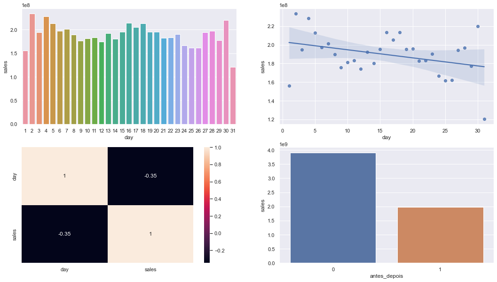
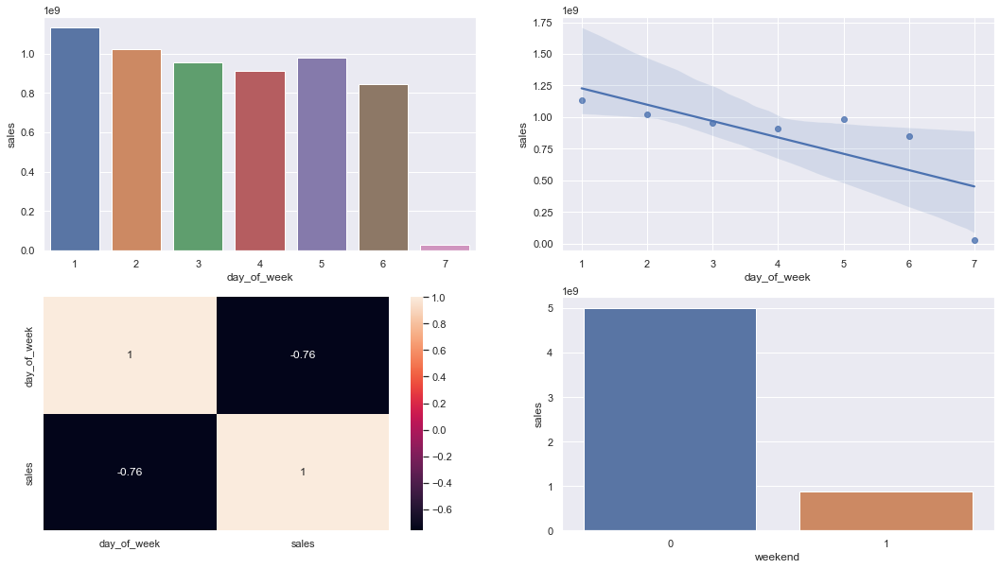
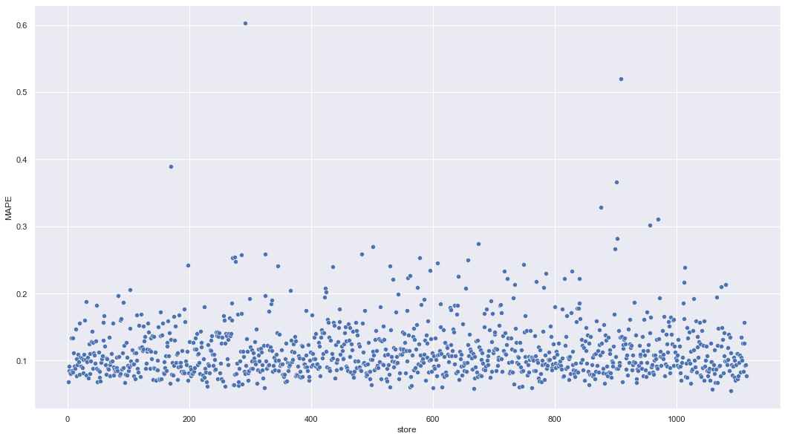

# Previsão de Faturamento - Rosmann
# 0.0 Orientações

Este é um projeto com dados extraídos e trabalhados do [Kaggle: Rossmann Store Sales](https://www.kaggle.com/c/rossmann-store-sales/overview). 

O Projeto em Produção está na propria nuvem do [Streamlit](https://regression-2022-1-rossmann.streamlit.app/). A API que realiza as predições foi disponibilizada no [Render](https://render.com/) por meio da url https://rossman.onrender.com

Caso queira entender mais minha experiência com o projeto, eu disponibilizei um [Artigo no Medium](https://medium.com/@gabrielnobregalvao/aprendizado-do-projeto-de-previs%C3%A3o-rossmann-group-c33eef1c6855)

# 1.0 Problema de Negócio

A empresa Rossmann opera mais de 3000 farmácias em 7 países na Europa. Como parte de um plano de modernização de suas lojas o CFO da deseja reforma-las, objetivando melhorar a estrutura e o atendimento ao público. Para isso, solicitou aos gerentes regionais uma previsão de faturamento das próximas 6 semanas, a fim de determinar o budget a investir em cada loja e se a loja tem condições financeiras de realizar a reforma.

Como o processo de previsão de faturamento é manual e ainda resulta em alguns erros. Pensando nisso o CFO chamou o time de dados para auxiliar todos os gerentes.

Desta forma o objetivo deste projeto é auxiliar o CFO na tomada de decisões, fornecendo a previsão de 6 semanas de forma automáticas para cada loja e permitindo a consulta de forma online.

# 2.0 Premissas de negócio

Foi realizado o levantamento de algumas premissas que o projeto precisa atender:

1. O CFO deve ter acesso às previsões de qualquer lugar.
2. O CFO precisa ter liberdade para analisar caso a caso.
3. Os dias em que as lojas estiveram fechadas serão excluídos da previsão.
4. A previsão considerará apenas as lojas que tiveram vendas superiores a 0 nos dados disponíveis.
5. A equipe definiu algumas metas financeiras a serem cumpridas para identificar se o estabelecimento pode ou não ser reformado e qual é o limite máximo do budget:
   1. Se a média do faturamento previsto for menor do que a média das faturamento, então não podemos fazer a reforma; caso contrário podemos fazer a reforma.
   2. Se a diferença do faturamento previsto for menor do que 2,5%, pode-se utilizar 7,5% do faturamento total para a reforma. Se estiver entre 2,5% e 5%, utiliza-se 10%; se for superior a 5%, utiliza-se 12,5% do faturamento.

## 2.1. Descrição dos Dados
| Atributo | Descrição |
| -- | -- |
| Store | Identificador único de cada loja |
| Date | Data em que ocorreu o evento de venda |
| DayOfWeek | Variável numérica que representa o dia da semana |
| Sales | Valor de vendas do dia |
| Customers | Quantidade de clientes na loja no dia |
| Open | Indicador para loja aberta = 1 ou fechada = 0 |
| StateHoliday | Indica se o dia é feriado de estado. a = Feriado público, b = Feriado de páscoa, c = Natal, 0 = Não há feriado |
| SchoolHoliday | Indica se a loja foi ou não fechada durante o feriado escolar |
| StoreType | Indica o modelo de lojas. Pode variar entre a, b, c, d |
| Assortment | Indica o nível de variedade de produtos: a = básico, b = extra, c = estendido |
| CompetitionDistance | Distância (em metros) para o competidor mais próximo |
| CompetitionOpenSince | [Month/Year] Indica o ano e mês em que o competidor mais próximo abriu |
| Promo | Indica se a loja está com alguma promoção ativa no dia |
| Promo2 | Indica se a loja deu continuidade na promoção: 0 = loja não está participando, 1 = loja participando |
| Promo2Since | [Year/Week]	Descreve o ano e semana de quando a loja começa a a promoção extendida |
| PromoInterval | Descreve os meses em que a loja iniciou a promo2, ex.: "Feb,May,Aug,Nov" significa que a loja iniciou as promoções estendidas em cada um desses meses |

# 3.0 Estratégia da Solução

Para garantir uma boa entrega foi adotado a metodologia CRISP-DM, na qual consiste em 9 passos. Esses passos são realizados de forma cíclica, ao qual o desenvolvedor passará por cada etapa algumas vezes, mas sempre aprofundando o conhecimento e o detalhismo na quela etapa.

## 3.1. Metodologia CRISP-DM

1. Problema de Negócio: Consiste em receber a demanda do negócio, definir quem é o real Product Owner e os Stakeholders deste projeto.
2. Entendimento de Negócio: Neste momento nós buscamos entender a real dor do negócio por meio de reuniões com o Product Owner e os Stakeholders e como podemos construir as primeiras prototipações da solução.
3. Coleta de Dados: Esta etapa realizamos a busca e a agregação das informações relevantes ao projeto, seja conectando-se em um Datalake, em um Banco de Dados, por meio de tabelas em .cvs ou até realizando um webscrapping.
4. Limpeza dos Dados: Tem como objetivo realizar todas as limpezas necessária afim de poder trabalhar com os dados sem problemas. É aqui que tratamos as strings, retimos os NAN's e cuidamos dos dados para que ele não perca as características do fenômeno.
5. Exploração dos Dados: Neste ponto buscamos entender as relações entre os dados e a variável ao qual buscamos prever. Neste ponto também desenvolvemos novas features cujo possam agregar ao fenômeno.
6. Modelagem dos Dados: Aqui iremos aplicar técnicas matemáticas e estatísticas afim de estruturar os dados da melhor forma possível para que o modelo ao ser treinado possa performar da melhor forma.
7. Aplicação de Algoritmos de Machine Learning: Esta etapa consiste em selecionar e treinar os Algorítmos de Machine Learning afim de começarmos a entender as primeiras previsões. Também aplicamos técnincas como: Validation Holdout, Cross-Validation, Fine Tunning.
8. Avaliação de Performance: Neste momento selecionamos o modelo que melhor generaliza, por meio de métricas a serem escolhidas conforme problema, ao ponto de conseguir predizer o que procuramos. Aqui há uma bifurcação, no qual se o modelo for bem avaliado ele irá para o passo 9 "Publicação da Solução", caso não, devemos retornar ao início do clíclo afim de obter melhores resultados
9. Publicação da Solução: Após a aprovação do modelo o Product Owner precisará utiliza-lo, desta forma deveremos publicar e disponibilizar de tal forma que ele possa ser acessado sem problemas.
## 3.2 Produto Final
O CFO receberá um site com 3 abas, sendo:
1. A primeira, informações gerais da solução e contato para suporte.
2. A segunda, possibilidade de realizar uma busca múltipla com vários estabelecimentos.
3. A terceira, possibilidade de realizar uma busca por estabelecimento, podendo escolher mais de 1 ao mesmo tempo.
4. Ao realizar a busca o sistema retornará uma tabela com as informações do ID da loja, o valor previsto do faturamento, se a loja está elegível para fazer a reforma e qual o valor máximo que pode ser gasto na loja.
5. O CFO poderá exportar os dados escolhidos para o formato .csv.
## 3.3 Ferramentas Utilizadas
Para criar a solução, foram utilizadas as seguintes ferramentas:

 - Python 3.10.4
 - Git e GitHub
 - Jupyter Notebook no VSCode
 - Técnicas de manipulação de dados.
 - Técnicas de redução de dimensionalidade e seleção de atributos.
 - Algoritmos de Machine Learning da biblioteca scikit-learn
 - Serviço de Hospedagem em Nuvem do Render. (Back-End)
 - Serviço Streamlit Cloud para aplicação web. (Front-End)

# 4.0 Análise dos Dados

Após a limpeza e o tratamento inicial dos dados. Foi realizado uma análise estatística da qual houve o desenvolvimento de novas features e levantamento de hipóteses de negócio.

## 4.1 Insights de Negócio
Foram levantadas, respondidas e aplicada um grau de relevância para o negócio em 12 hipóteses conforme quadro a baixo:

| Hipótese | Pergunta | Resultato | Relevancia |
| -------- | --- | --------- | ---------- |
| H1 | Lojas com maior sortimento deveriam vender mais. | FALSA | BAIXA |
| H2 | Lojas com competidores mais próximos deveriam vender menos. | FALSA | MEDIA |
| H3 | Lojas com competidores a mais tempo vender mais. | FALSA | MEDIA |
| H4 | Lojas com promoção ativa por mais tempo deveriam vender mais. | FALSA | BAIXA |
| H5 | <s>Lojas com mais dias de promoção deveriam vender mais.</s> | --- | ---  |
| H6 | Lojas com mais promoções consecultivas deveriam vender mais. | FALSA | BAIXA |
| H7 | Lojas abertas durante o feriado de Natal deveriam vender mais. | FALSA | MEDIA |
| H8 | Lojas deveriam vender mais ao longo dos anos. | FALSA | ALTA |
| H9 | Lojas deveriam vender mais no segundo semestre do ano. | FALSA | ALTA |
| H10 | Lojas deveriam vender mais depois do dia 10 de cada mês. | FALSO | ALTA |
| H11 | Lojas deveriam vender menos aos finais de semana. | VERDADEIRA | ALTA |
| H12 | Lojas deveriam vender menos durante os feriados escolares. | VERDADEIRA | BAIXA |

Irei destacar somente as 2 hipóteses com maior impacto no negócio.

### H10. Lojas deveriam vender mais depois do dia 10 de cada mês.
Hipótese Falsa. Percebe-se que há um decréscimo nas vendas após o dia 10. E a distribuição de vendas ao longo do mês a caba sendo bem estável com um leve declínio durante todo o mês.

### H11. Lojas deveriam vender menos aos finais de semana.
Hipótese Verdadeira. Realmente no final de semana há uma diminuição abrupta nas vendas, parte disso deve-se ao fato do Domingo ter um movimento comercial muito baixo.

# 5. Modelos de Machine Learning Utilizados
Fora selecionados 5 algoritmos de regrssão linear para serem treinados, testados e avaliados.
Os algotitmos selecionados foram:

1. Avarege Model
2. Linear Regression
3. Linear Regression - Lasso
4. Random Forest Regressor
5. XGBRegressor
# 6. Seleção do Modelo de Machine Learning
Foi escolhido MAPE (Mean Absolute Percentage Error) como a  métrica principal de avaliação pois ele representa a procentagem do erro médio em relação ao valor real. Essa representação torna mais fácil a equipe de negócio entender o melhor e o pior cenário, conforme a métrica dos algorítmos.
## 6.1. Métricas dos Algoritmos
Com esse método de validação, foram obtidas as seguintes performances:

| Index | Model Name | MAE | MAPE | RMSE |
| ----- | ---------- | --- | ---- | ---- |
| 0 | Linea Regression | 2083.17 +/- 294.98 | 0.3 +/- 0.02 | 2958.87 +/- 466.72 |
| 1 | Linear Regression - Lasso | 2117.66 +/- 340.94 | 0.29 +/- 0.01 | 3061.89 +/- 503.23 |
| 2 | Random Forest Regressor | 836.61 +/- 217.1 | 0.12 +/- 0.02 | 1254.3 +/- 316.17 |
| 3 | XGBRegressor | 7049.2 +/- 588.65 | 0.95 +/- 0.0 | 7715.2 +/- 689.51 |

## 6.2 Escolha do Modelo
O modelo inicialmente escolhido foi o Random Forest Regressor, mas devido a diversos problema com o ambiente em produção tive que mudar para o XGBRegressos, devido os motivos a baixo:
1. O Random Forest é bem maior do que o XGBRegressor e mais pesado para treinar.
2. A plataforma de hospedagem RENDER, na sua versão gratuita tem diversas limitações e uma delas é de performance e espaço, desta forma o XGBRegressor foi o que consegui subir e fazer uma API para ele.
3. Apesar dele ter dado um alto valor no RMSE foram feitos outros testes com cross-validation e fine tunning no qual consegui baixar esses métricas tornando-o com uma boa performance evitando o overfetting e o underfetting do modelo.
## 6.3 Métricas do Modelo Final
A métrica final do modelo ficou desta forma:

| Index | Model Name | MAE | MAPE | RMSE |
| ----- | ---------- | --- | ---- | ---- |
| 0 | XGBRegressor | 767.8670 | 0.1153 | 1104.9996 |

# 7. Resultado de Negócio

## 7.1 Performance do Modelo
Nos gráficos da primeira linha percebe-se que o modelo consegue prever o movimento cíclico da temporariedade dos dados com pouca divergência no erro.

O terceiro gráfico que calcula o erro tem uma distribuição Gausiana, mais próxima de uma curva Normal, isso é mais um indicador que o modelo está performando bem.

Por fim o 4º gráfico de dispersão mostra a distribuição do erro de forma tubular demonstrando pouca variação nas predições.

Mesmo com esses indicadores há alguns pontos a serem trabalhados principalmente os outliers no 4º gráfico ao qual aprensenta alguns outliers a serem estudados em um segundo momento.

## 7.2 Performance Estratificada
Esta performance trata da variação do MAPE, métrica escolhida, para cada loja. Na distribuição é demonstrada uma grande concentração das lojas mais próximo do valor zero e ao passo que tomam distancia a quantidade de lojas também diminui.
Essa visualização é positiva pois corrobora com as análises anterirores de que o modelo está tendo pouco erro.

## 7.3 Performance Financeira
Com o modelo desenvolvido conseguimos chegar a essas previsões financeiras.

| Index | cenarios | values |
| ----- | -------- | ------ |
| 0 | Predições | R$285,982,336.00 |
| 1 | Pior Cenário | R$285,122,909.38 |
| 2 | Melhor Cenário | R$286,841,799.87 |
# 8.0 Aplicação em Produção
O serviço de predição foi disponibilizado na nuvem do render através do link https://rossman.onrender.com com um serviço de API desenvolvido com FLASK.

A aplicação visual para o CFO está rodando atualmente no Streamlit. [Neste link](https://regression-2022-1-rossmann.streamlit.app/)

Foi desenvolvido também em uma versão de um bot no telegram, mas atualmente ela está desatualizada devido a mudança da API. Quando tiver tempo vou atualizar o bot no Telegram e fornecer o link aqui.
# 9.0 Conclusão
Esta é a primeira versão utilizável do modelo, obviamente ainda há melhorias a serem feitas, mas por ser uma versão estável o CFO já pode começar a realizar os planejamentos necessários para a reforma desejada.
# 10.0 Próximos Passos de Melhoria
Os pontos de melhoria são:
1. Estudo mais aprofundado das lojas que possuiram maiores outliers, podendo, em último caso, ser nescessário até desenvolver um modelo único para essa loja.
2. Testar outros algorítmos de regressão e verificar sua resposta afim de aprimorar as previsões.
3. Criar novas features que possam ajudar a explicar o modelo e fazer com que ele tenha uma melhor performace.
4. Pensar em novas hipóteses junto ao time de negócio com o objetivo de entrender melhor os dados.
# 11.0 Aprendizado do projeto
O aprendizado do projeto foi descrito no Medium para facilitar a leitura.
# 12. Contatos

<ul class="actions">
    <table>
        <tr>
            <th><i class="fa-solid fa-folder-tree"></i><a href="https://bit.ly/portfolio-gabriel-nobre"> Portfólio de Projetos</a></th>
            <th><i class="fa-brands fa-linkedin"></i><a href="https://www.linkedin.com/in/gabriel-nobre-galvao/"> Linkedin</a></th>
            <th><i class="fa-brands fa-medium"></i><a href="https://medium.com/@gabrielnobregalvao"> Medium</a></th>
            <th><i class="fa-brands fa-github"></i><a href="https://github.com/Gabrielnbr"> Git Hub</a></th>
            <th><i class="fa-solid fa-envelope"></i><a href="mailto:gabrielnobregalvao@gmail.com"> E-mail</a></th>
        </tr>
    </table>
</ul>